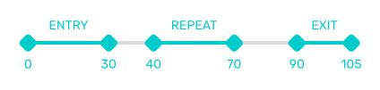
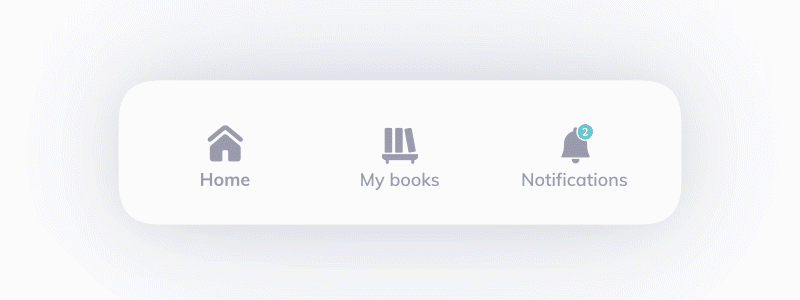
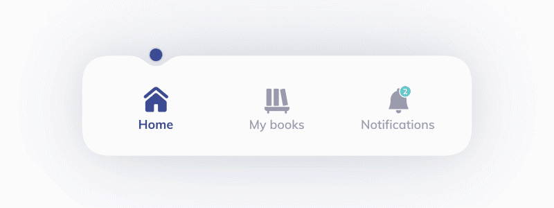

# Lottie Navigation Bar

## What's Lottie?
---

[**Lottie**](https://github.com/airbnb/lottie-web) library gives you the tools to render animations on the web or in mobile applications. These animations are first created in Adobe After Effects - or other animation software - and exported to a specially formated `.json`

This gives motion designers more freedom in creating complex animations and necessary control over the animation to the developers.

This example shows how you can implement a navigation bar with animations, states and clickable areas prepared right inside After Effects.

## How does it work?
---

### Clickable Areas
The navigation bar in this example has 3 clickable areas for each section. Those are specified directly in After Effects by placing a rectangle with 0% opacity fill on a separate layer and naming it like a css id selector (e.g. `#home`).

### Entry, Repeat & Exit Animations
There are 3 type of animations in this example.

You can set your animation length and starting frames any way you want. Values presented below might help you understand our code better.

Animations for each section are laid out on the timeline in After Effects like so:

These animations are then repeated for each section:
- Home – starting from frame 0
- My books – starting from frame 120
- Notifications - starting from frame 240

**Entry animation**

- Starting frame: 0
- Duration: 30 frames

**Repeat animation**

- Starting frame: 40
- Duration: 30 frames

**Exit animation**

- Starting frame: 90
- Duration: 15 frames

---
## HTD Health
HTD Health is a digital services group working with healthcare and wellness clients. Our team specializes in virtual care strategy, research, product design, and software development.

htdhealth.com | info@htdhealth.com